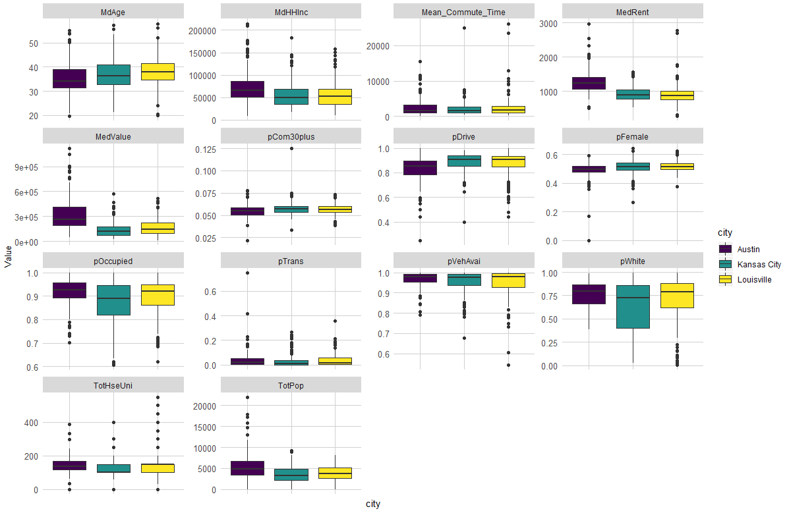
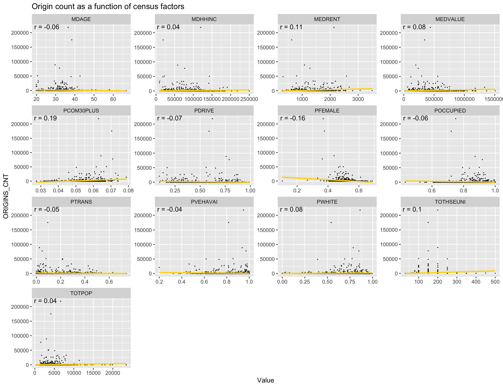

**%% note %% = internal notes**

```{r setup, include=FALSE}
data_directory <- file.path(stringr::str_remove(here::here(), 
                                                "\\/Eugene\\/Eugene - Practicum|\\/Ophelia\\/Ophelia - Practicum|\\/Xinyi\\/Xinyi - Practicum"), 
                        "~data")

knitr::opts_chunk$set(echo = TRUE, message = FALSE, warning = FALSE, cache = TRUE)

census_key_RDS <- file.path(data_directory,
                            "~RData/Census/EC_census_key")
census_key <- readRDS(census_key_RDS)
tidycensus::census_api_key(census_key, install = TRUE, overwrite = TRUE)

setwd(here::here())
options(scipen = 999)

library(knitr)
library(kableExtra)
```

%% Read in all scripts here %%

%% cache all inputs and uncache when scripts are updated %%

```{r load scripts, echo = TRUE, results = "hide"}
# admin
source("~code/01 - Admin (Closed).R")
source("~code/02 - Census Vars and Functions (Closed).R")

# Austin
source("~code/Austin/AU - 02 - Clean Scooter Data (Open).R")
source("~code/Austin/AU - 21 - Collect and Clean Census Data (Open).R")

# Chicago
source("~code/Chicago/CH - 01 - Read Scooter Data (Closed).R")
source("~code/Chicago/CH - 20 - Collect Census Data (Open).R")
source("~code/Chicago/CH - 21 - Clean Census Data (Open).R")

# DC

# Kansas City

# Louisville
source("~code/Louisville/LV - 01 - Read Scooter and Base Map Data (Closed).R")
source("~code/Louisville/LV - 02 - Clean Scooter Data (Closed).R")
source("~code/Louisville/LV - 03 - Prep Rebalance Data - User Events (Closed).R")
source("~code/Louisville/LV - 04 - Prep Rebalance Data - Rebalance Events (Closed).R")
source("~code/Louisville/LV - 20 - Collect Census Data (Closed).R")
source("~code/Louisville/LV - 21 - Clean Census Data (Closed).R")

# Minneapolis

# Model
source("~code/Model/Model - 01 - Setting up (Open).R")
```

# 1. Introduction

## 1.1 About this Project

The following document presents an analysis of shared, dockless electric scooter systems in several American cities and a web tool for predicting scooter demand in cities that do not currently have shared scooters. We focus in particular on the equity implications of these systems: who currently has access to scooters, and who will have access if we keep following the business-as-usual approach? This document presents an overview of our data and use case, a summary and key takeaways from our analysis, and an appendix with all of the R code necessary to replicate our work.

This project was produced for the [MUSA/Smart Cities Practicum course (MUSA 801)](https://pennmusa.github.io/MUSA_801.io/) taught by Ken Steif, Michael Fichman, and Matt Harris in the Master of Urban Spatial Analytics and Master of City Planning Programs at the University of Pennsylvania. We are deeply grateful to our instructors for their guidance, feedback, and attention throughout the semester, despite the challenges brought on by the ongoing pandemic. We also thank Michael Schnuerle from the City of Louisville Metro Government and Sharada Strasmore from the DC Department of Transportation for providing data that made our rebalancing analysis possible as well as sharing their insights into and knowledge of the scooter and micromobility planning process. Lastly, we would like to acknowledge our classmates in MUSA and city planning, who not only produced incredible projects of their own this semester, but also provided thoughtful feedback and support throughout our time in the programs.

## 1.2 Abstract

In the few short years since they first launched, shared, dockless electric scooters have become ubiquitous sights on streets and sidewalks in cities across America. What may have first been seen as novelties or purely recreational vehicles now play critical roles in many people’s daily transportation routines. Despite being relative newcomers to the urban transportation system, dockless scooters provided over 38 million trips in 2018, more than the number of rides taken on traditional station-based bikeshare systems that year. Yet, while electric scooters have quickly enmeshed themselves in the urban fabric, access to these vehicles is not spread equitably across cities. While residents in wealthier, predominantly white downtown neighborhoods enjoy easy access to shared scooters, residents in poorer but comparably dense parts of cities outside of downtown are underserved by the systems.

In this study, we use a combination of open and private dockless scooter usage data from six American cities to construct a model for predicting ridership in ten cities that have not had scooter share systems in the past. Our model shows that the business-as-usual approach to introducing scooters into a new market is likely to create inequitable access to the vehicles for residents. While cities such as Louisville, KY have recognized these inequities and instituted distribution requirements to address them, we show through analysis of vehicle rebalancing data that providers do not seem to be complying with these requirements, and stronger enforcement may be necessary. Lastly, we introduce a proof-of-concept web application that allows users to explore the spatial distribution of our model’s predictions for each city and compare them to demographic and socioeconomic variables of interest. We believe that this tool will allow policymakers to anticipate the geography of scooter ridership in their cities and understand - and ultimately plan for - the inequities created by the business-as-usual approach to launching and administering scooter share systems.


## 1.3 Motivation

Since Bird and Lime launched the first shared, dockless electric scooter services in [Santa Monica, California in September 2017](https://www.theverge.com/2018/9/20/17878676/electric-scooter-bird-lime-uber-lyft), scooters have rapidly spread across American cities, becoming a popular form of urban transportation. As of January 2020, there are [340 scooter share programs](https://boxercycles.com/scooter-share-companies/) operating in 242 municipal areas and campuses across 40 different states (plus Washington D.C.). In 2018 alone, [users took 38.5 million trips on electric scooters](https://nacto.org/2019/04/17/84-million-trips-on-shared-bikes-and-scooters/), more than the number of trips taken on more familiar, traditional station-based bikeshare systems. While scooter share providers initially entered new municipalities and markets without local officials’ permission or oversight, leading to spikes in scooter-related injuries and complaints of vehicles blocking sidewalks, cities have begun collaborating through coalitions like the [Open Mobility Foundation](https://www.openmobilityfoundation.org/) to institute some oversight over these programs. Many municipalities are now working with their scooter providers to ensure that their scooter share programs, among other goals, meet safety standards, distribute vehicles equitably, keep sidewalks clear, and protect rider privacy. Data standards like the [Mobility Data Specification (MDS)](https://ladot.io/wp-content/uploads/2018/12/What-is-MDS-Cities.pdf), created by the Los Angeles Department of Transportation, help cities share and monitor scooter ridership data and make sure that providers are complying with their policies.

While these data initiatives help address cities manage more mature scooter share programs, there are no widely adopted models or processes in place that help cities without shared scooters introduce the vehicles into their markets. Further, while some cities like Chicago have [issued citations to enforce their requirements for equitable distribution](https://www.chicagotribune.com/business/transportation/ct-biz-scooter-companies-cited-20190702-2wla72ja4bfb7jf4rxnq63o3ty-2wla72ja4bfb7jf4rxnq63o3ty-story.html), not all cities have done so, meaning that in some places, these distribution requirements are without teeth. As we see in our analysis of vehicle distribution in Louisville, scooter companies do not necessarily comply with existing distribution requirements. In this project, we use data from 6 different American cities with shared scooters to develop a model that estimates what peak-season demand will be in cities without existing programs. We use this model to build a prototype for a web application intended to help city officials anticipate the geography of scooter ridership in their cities and understand its relationship to the city’s social and economic geography. Our goal is to create a municipal scooter planning toolkit that helps cities interested in launching scooter share systems learn from other municipalities that already have these systems in place. We hope that cities like Philadelphia, Pennsylvania and Madison, Wisconsin, which are considering adopting scooter share programs, will find this toolkit helpful as they work with providers to bring the vehicles to their communities.

## 1.4 Summary

Using a combination of publicly available and private scooter ridership data from six American cities, we use machine learning methods to create a model that predicts the total scooter trips that will be taken between July and September in each census tract in 10 cities that do not currently have scooter share programs. Our model uses a total of 24 features encompassing demographic, socioeconomic, and built environment characteristics for the cities to make its predictions. We emphasize that our model predictions reflect both the underlying demand for scooters that may exist in a census tract as well as the impact of the scooter companies’ fleet management and distribution choices. Our model uses existing ridership data to predict how scooter usage would look in a new city if it were to follow the business-as-usual approach.

Based on our model predictions, we find that the business-as-usual approach will likely lead to inequitable access in new cities. Census tracts with high predicted ridership tend to be %%[...]%%, whereas tracts with lower ridership tend to be %%[...]%%. We propose combining these socioeconomic indicators into a single Equity Score, which cities could customize to their own priorities and rely on while planning and launching a scooter share system or policy. 

# 2. Data

## 2.1 Outcome Variable and Unit of Analysis

For our unit of analysis, we use the total number of rides taken between July and September of 2019 in each census tract for each city. We chose this time period partly due to data limitations - Chicago only recently instituted scooter share and does not have a full year of data available - and also because the later summer and early fall represent peak ridership. We chose census tracts as our spatial unit of analysis because they represent the highest level of geographic aggregation in the scooter ridership datasets. While the private Louisville and Washington, D.C. datasets provide coordinates for ride pick-ups and drop-offs, Austin’s publicly available dataset aggregates rides to the pick-up and drop-off census tract to protect rider privacy.

In addition to the level of geographic aggregation, the ridership data provided varying information.

```{r, echo = FALSE}
data_info <- data.frame(City = c("Louisville", "Washington, DC", "Austin", "Minneapolis", "Kansas City", "Chicago"),
                        GeographicAggregation = c("Coordinates", "Coordinates", "Census Tract", "Street", "Truncated Coordinates", "Census Tract"),
                        TimePeriodAvailable = c("Nov. 2018 - Dec. 2019", "", "April 2018 - Present", "May 2019 - Sept. 2019", "June 2019 - Dec. 2019", "June 2019 - Sept. 2019"),
                        TemporalPrecision = c("Actual time", "Actual time", "15 minutes", "30 minutes", "15 minutes", "Hour"),
                        OtherInfo = c("Trip ID <br>Vehicle ID<br>Battery Level", "Trip ID<br>Vehicle ID<br>Trip Distance<br>Trip Duration", "Trip ID<br>Vehicle ID<br>Trip Distance<br>Trip Duration<br>Council District", "Trip ID<br>Vehicle ID<br>Trip Distance<br>Trip Duration", "Trip ID<br>Vehicle ID<br>Trip Distance<br>Trip Duration", "Trip ID<br>Vehicle ID<br>Trip Distance<br>Trip Duration<br>Community Area Name"),
                        FleetInfo = linebreak(c("Operator <br>Rebalancing <br>Vehicle Maintenance/Retirement/Entry", "Operator", "No", "No", "No", "No")),
                        stringsAsFactors = FALSE)
```

```{r, echo = FALSE}
kable(data_info, 
      col.names = c("City",
                    "Geographic Aggregation",
                    "Time Period Available", 
                    "Temporal Precision",
                    "Other Info",
                    "Fleet/Rebalancing Info"),
      escape = FALSE) %>% 
  kable_styling(bootstrap_options = c("striped", "hover", "condensed"))
```

Part of our data wrangling process was transforming the ridership data into the same level of spatial aggregation. Chicago, for instance, was already aggregated at the census tract level, so it did not require any additional aggregation.

```{r, echo = FALSE, out.height="60%", out.width="60%"}
include_graphics(c("Markdown_plots/2.1 CH_ride_plot.png"))
```

Louisville and DC, on the other hand, provided point data. We aggregated this to the census tract level.

```{r, echo = FALSE, out.height="40%", out.width="40%"}
include_graphics(c("Markdown_plots/2.1 LV_ride_plot_disagg.png", "Markdown_plots/2.1 LV_ride_plot_agg.png"))
```


## 2.2 Explanatory Variables

For our model features, we use variables from the US Census Bureau and OpenStreetMap that we believe would reflect both the underlying demand for scooters in a census tract and the likelihood that a provider would make more vehicles available in a tract.

**Demographic**

* Total Population
* Median Age
* Percentage White Population
* Percentage Female Population

**Socio-economic**

* Household Income
* Home Values and Rental Prices
* Commute Modeshare (transit v driving)
* Commute Distance (30+ minutes)
* Housing Units and Occupancy Rates
* Vehicle Ownership
* Jobs

**Built Environment**

* Retail Stores
* Restaurants
* Leisure Activities and Tourism Destinations
* Transportation Infrastructure
* Offices

Our final model uses 24 features built from these variables that served as useful predictors for scooter ridership in a census tract. Our data panel looked like the below:

```{r, echo = FALSE}
kable(head(Model_clean, 10) %>% 
        dplyr::select(ORIGINS_CNT, everything())) %>% 
  kable_styling(bootstrap_options = c("striped", "hover", "condensed")) %>% 
  scroll_box(width = "100%", height = "100%")
```

# 3. Exploratory Analysis and Feature Engineering

## 3.1 Scooter Ridership Data

A map of the 6 cities shows that most rides originate and end in a small number of census tracts.

### Scooter Trips by City {.tabset}

#### Louisville

```{r, echo = FALSE, out.height="40%", out.width="40%"}
include_graphics(c("Markdown_plots/3.1 LV_Inflow.png", "Markdown_plots/3.1 LV_Outflow.png"))
```

#### Washington, DC

```{r, echo = FALSE, out.height="40%", out.width="40%"}
include_graphics(c("Markdown_plots/3.1 DC_Inflow.png", "Markdown_plots/3.1 DC_Outflow.png"))
```

#### Austin

```{r, echo = FALSE, out.height="40%", out.width="40%"}
include_graphics(c("Markdown_plots/3.1 AU_Inflow.png", "Markdown_plots/3.1 AU_Outflow.png"))
```

#### Minneapolis

Inflow data is not available for Minneapolis.

```{r, echo = FALSE, out.height="40%", out.width="40%"}
include_graphics(c("Markdown_plots/3.1 MNP_Outflow.png"))
```

#### Kansas City

```{r, echo = FALSE, out.height="40%", out.width="40%"}
include_graphics(c("Markdown_plots/3.1 KC_Inflow.png", "Markdown_plots/3.1 KC_Outflow.png"))
```

#### Chicago

```{r, echo = FALSE, out.height="40%", out.width="40%"}
include_graphics(c("Markdown_plots/3.1 CH_Inflow.png", "Markdown_plots/3.1 CH_Outflow.png"))
```

### {-}

A persistent problem in micromobility programs is unbalanced vehicle flow, when riders take more vehicles away from a place than other riders bring in. Which tracts are “gaining” and “losing” vehicles from user activity alone? While, of course, many rides begin and end within the same census tract, we see below user activity leads to unbalanced flows. Without active rebalancing from providers, vehicles would become concentrated in just a few tracts, and user demand in other tracts would go unsatisfied.

The plots on the left show the net inflow/outflow of vehicles for each census tract during the study period. The maps on the right show this rate relative to its total inflow; a tract that gained a net of 10 vehicles while seeing a total inflow of 20 vehicles would have an inflow rate of 0.5.

### Net Scooter Flows by City {.tabset}

#### Louisville

```{r, echo = FALSE, out.height="40%", out.width="40%"}
include_graphics(c("Markdown_plots/3.1 LV_Net_inflow.png", "Markdown_plots/3.1 LV_Net_inflow_rate.png"))
```

#### Washington, DC

```{r, echo = FALSE, out.height="40%", out.width="40%"}
include_graphics(c("Markdown_plots/3.1 DC_Net_inflow.png", "Markdown_plots/3.1 DC_Net_inflow_rate.png"))
```

#### Austin

```{r, echo = FALSE, out.height="40%", out.width="40%"}
include_graphics(c("Markdown_plots/3.1 AU_Net_inflow.png", "Markdown_plots/3.1 AU_Net_inflow_rate.png"))
```

#### Minneapolis

Net flow data is not available for Minneapolis.

#### Kansas City

```{r, echo = FALSE, out.height="40%", out.width="40%"}
include_graphics(c("Markdown_plots/3.1 KC_Net_inflow.png", "Markdown_plots/3.1 KC_Net_inflow_rate.png"))
```

#### Chicago

```{r, echo = FALSE, out.height="40%", out.width="40%"}
include_graphics(c("Markdown_plots/3.1 CH_Net_inflow.png", "Markdown_plots/3.1 CH_Net_inflow_rate.png"))
```

### {-}

Some of the data sets include information on ride durations and distances. We don’t include investigate those data here, as they were not pertinent to our prediction model, but we do explore them later on when we discuss compliance with distribution requirements.

## 3.2 Feature Variables

The six cities we’ve chosen for the analysis vary greatly in size and demographic and socioeconomic characteristics. This makes producing a model that predicts raw trip counts a difficult challenge, but it also protects against the possibility of our model overfitting to a certain type of city.

### Distributions by City {.tabset}

#### Demographic

```{r, echo = FALSE}

```

#### Socio-economic

```{r, echo = FALSE}

```

### {-}

During the feature engineering process, we experimented with variations of the built environment variables.  We tried the variations below:

* **Density:** The number of restaurants per square mile in the tract
* **Count:** The total number of restaurants in the tract
* **KNN:** The distance from the tract centroid to the newest k restaurants (where we experimented with a range of k values)
* **Ratio:** The percentage of the city’s restaurants located within that tract

Ultimately, we selected the Ratio versions, because those displayed the greatest correlation with user pickups in each tract.  Below, we see the correlation plots for every feature variable in our analysis with the number of pickups in each tract.

### Correlation Plots {.tabset}

#### Demographic

```{r, echo = FALSE}

```

#### Socio-economic

```{r, echo = FALSE}

```

#### Built Environment

```{r, echo = FALSE}

```

### {-}

### Final Features

Our final model included the following 24 features:

```{r, echo = FALSE}
final_features <- data.frame(
                            # Type = c("Demographic","Demographic","Demographic","Demographic",
                            #           
                            #           "Socio-economic","Socio-economic","Socio-economic","Socio-economic",
                            #           "Socio-economic","Socio-economic","Socio-economic","Socio-economic",
                            #           "Socio-economic","Socio-economic","Socio-economic",
                            #           
                            #           "Built Environment","Built Environment","Built Environment",
                            #           "Built Environment","Built Environment","Built Environment",
                            #           "Built Environment","Built Environment","Built Environment"),
                             
                             Variable = c("TOTPOP", "MDAGE", "PWHITE", "PFEMALE",
                                          
                                          "MDHHINC", "MEDVALUE", "MEDRENT", "PTRANS",
                                          "PDRIVE", "PCOM30PLUS", "TOTHSEUNI", "POCCUPIED",
                                          "PVEHAVAI", "JOBS_IN_TRACT", "WORKERS_IN_TRACT",
                                          
                                          "RATIO_RETAIL", "RATIO_OFFICE", "RATIO_RESTAURANT",
                                          "RATIO_PUBLIC_TRANSPORT", "RATIO_LEISURE", "RATIO_TOURISM",
                                          "RATIO_COLLEGE", "RATIO_CYCLEWAY", "RATIO_STREET"),
                             
                             Description = c("Total population", "Median age", "% of the population that is white", "% of the population that is female",
                                             
                                             "Median household income (2018 dollars)", "Median home value", "Median rent", "% of the population that takes transit to work",
                                             "% of the population that drives to work", "% of the population with a commute >30 minutes", "Total housing units", "Housing occupancy rate",
                                             "% of the population that owns a vehicle", "The number of jobs located in this tract", "The number of workers who live in this tract",
                                             
                                             "% of the city’s retail found in this tract", "% of the city’s offices found in this tract", "% of the city’s restaurants found in this tract",
                                             "% of the city’s public transportation found in this tract", "% of the city’s places for leisure activity found in this tract", "% of the city’s tourist attractions found in this tract",
                                             "% of the city’s university buildings found in this tract", "% of the city’s cycle infrastructure found in this tract", "% of the city’s streets found in this tract"),
                             
                             stringsAsFactors = FALSE)
```

```{r, echo = FALSE}
kable(final_features) %>% 
  kable_styling(bootstrap_options = c("striped", "hover", "condensed")) %>% 
  pack_rows("Demographic", 1, 4) %>% 
  pack_rows("Socio-economic", 5, 15) %>% 
  pack_rows("Built Environment", 16, 24) 
```

Below, we see a display a correlation matrix with the final features:

%%[corr plot takeaways]%%

# 4. Case Study: Louisville Rebalancing Compliance

Like many cities with scooter share, the City of Louisville has imposed vehicle caps and distribution requirements on their providers to ensure that scooter companies do not flood high traffic areas of the city with unused vehicles and to promote equitable access to the vehicles across neighborhoods. Louisville's scooter policy is summarized below and can be found in full [here](https://data.louisvilleky.gov/sites/default/files/Dockless_Policy_7_12_2019.pdf "Louisville Dockless Vehicle Policy").

**Policy:**

* Distribution Requirements
  + "To ensure access to shared mobility transportation options throughout the community, Metro has established distribution zones. Distribution zones are intended to ensure that no singular zone is intentionally over-served or under-served. Operators must comply with distributional requirements. Failure to comply with this provision constitutes a breach of the license and may result in the assessment of fleet size reductions, suspension, or even termination of the license. The duration of any suspension shall be at the sole discretion of Metro but will be no less than 6 months. Terminations shall apply for 1 year."

  + For operators with 150 permitted vehicles or fewer, there are no distributional requirements.
  + For operators with permitted fleets ranging in size between 150 and 350 vehicles, 20% of each operator’s vehicles must be located within zones 1 and 9.
  + Distribution plans within Zones 1 and 9 must be submitted to Metro for approval to ensure adequate accessibility for residents of each zone has been achieved.
  + For fleets ranging in size between 350 and 1050 vehicles, 20% of each operator’s vehicles must be located within zones 1 and 9 and 10% must be in zone 8.
  + Distribution plans within Zones 1, 8, and 9 must be submitted to Metro for approval to ensure adequate accessibility for residents of each zone has been achieved.

* Current Vehicle Limits:

  + Bird - 450 max vehicles/day - launched August 2018
  + Lime - 450 max vehicles/day - launched November 2018
  + Bolt - 150 max vehicles/day - launched July 2019
  + Spin - 150 max vehicles/day - launched August 2019

For privacy reasons, most cities (including Louisville) only post geographically aggregated user ride data on their public open data sites. These datasets, while helpful for identifying broad trends in ridership, can lack the geographic resolution to tell us where exactly riders are going. Additionally, the datasets typically do not include any information on vehicle movements other than user rides, meaning we cannot discern where providers are adding or removing vehicles to and from the fleet through maintenance or rebalancing activity.  For our analysis, the City of Louisville shared their providers' _status changes_ dataset (the "Rebalancing Data"), a non-public dataset that, in addition to user ride data, includes other vehicle events such as rebalancings and maintenance. These data points are also fully disaggregated. Whereas Louisville's public scooter dataset rounds location coordinates to the third decimal point, the Rebalancing Data includes the raw coordinates.

Using the Rebalancing Data, we investigate whether Louisville's largest two scooter suppliers, Bird and Lime, which are its only suppliers subject to the distribution requirements, have been complying with the city's policy. _At distinct points in time, are Bird and Lime's scooter vehicles distributed across Louisville in compliance with the distribution requirements?_

A map of zones 1, 8, and 9, which must receive a percentage of Bird and Lime's daily fleet as part of the distribution requirements, is shown below.

```{r, echo = FALSE}
LV_distro_areas <- LV_distro_areas_raw %>% 
  mutate(Dist_Zone = as.character(Dist_Zone),
         # include the requirement for fleets between 350 and 1050. Currently the only requirements that apply
         rebal_req = case_when(Dist_Zone %in% c("1", "9") ~ 0.2,
                                 Dist_Zone == "8" ~ 0.1,
                                 TRUE ~ NA_real_)) %>% 
  st_transform(LV_proj)

LV_distro_areas_map <- LV_distro_areas %>% 
  mutate(Dist_Zone2 = case_when(Dist_Zone %in% c(1, 9) ~ "Zones 1 and 9 (20%)",
                                Dist_Zone == 8 ~ "Zone 8 (10%)",
                                TRUE ~ NA_character_))
```

```{r, echo = FALSE}
ggplot() +
  geom_sf(data = LV_distro_areas_map, aes(fill = Dist_Zone2)) +
  scale_fill_viridis_d(name = "Distribution Zones",
                       limits = c("Zones 1 and 9 (20%)", "Zone 8 (10%)"),
                       direction = -1, 
                       na.value = "lightgray") +
  mapTheme() +
  labs(title = "Scooter Rebalancing Requirements in Louisville")
```

In its raw form, however, the Rebalancing Data is not well-suited for answering this question. The dataset is currently organized around events, where each row is a status change event (the `reason` column) for a particular vehicle (`vehicleId`) that took place at a certain `location` and time (`occurredAt`), making it difficult to develop an aggregate picture for how each operator's vehicles are distributed across the city at any point in time. The dataset tells us about vehicle _flows_, but we need information on the vehicle _fleet_.

```{r, echo = FALSE}
glimpse(LV_rebal_raw)
```

We solve this problem by selecting the most recent event for each vehicle in the dataset (prior to the selected audit time), finding each vehicle's location, and assessing whether it is available for users. Then, we can aggregate the available scooters by distribution zone to determine whether the scooter providers are in compliance.

The Rebalancing Data contains 11 different status change events. We aggregate these events into three categories: 

* **Active:** Scooters whose most recent event was an Active event are available for users to ride.
* **Reserved:** These scooters are currently being used by a rider.
* **Inactive:** These scooters are not available to users. We consider them removed from the vehicle fleet.

```{r, echo = FALSE}
LV_active_status <- c("user drop off",
                      "rebalance drop off",
                      "maintenance drop off",
                      "service start",
                      "user pick up")

LV_reserved_status <- c("user pick up")

LV_inactive_status <- c("rebalance pick up",
                        "maintenance pick up",
                        "service end",
                        "low battery",
                        "maintenance")
```

We next set time periods for our rebalancing audits. We decided to audit the vehicle fleet at 7AM every Friday for 13 months, from November 15th, 2018 to December 15th, 2019. We chose 7AM because our exploratory analysis revealed to us that most rebalancing activity occurs in the nighttime and early morning hours.

```{r, echo = FALSE}
LV_rebal_DOW_data <- LV_rebal_rebalance_only %>% 
  mutate(hour = hour(occurredAt),
         weekday = lubridate::wday(occurredAt, label = TRUE))

LV_rebal_DOW_data %>% 
  ggplot() +
  geom_freqpoly(aes(hour, color = weekday), binwidth = 1) +
  labs(title = "Scooter Rebalancing in Louisville by day of week and hour",
       x="Hour", 
       y="Trip Counts")+
  xlim(0, 23)+
  theme_minimal()

time_intervals <- seq(from = as.POSIXct("2018-11-15 07:00:00 EDT"), 
                      to = as.POSIXct("2019-12-15 07:00:00 EDT"),
                      by = "1 week")
```

We then define a function to extract the most recent Active status in the dataset for each vehicle before our 57 selected audit times. We also remove any scooter whose most recent Active status occurred over 10 days prior to the audit time from the dataset. We assume that these scooters have been removed from the active vehicle fleet without a corresponding status change record.

```{r, eval = FALSE, echo = TRUE}
plan(multiprocess) ## FOR PARALLEL PROCESSING

LV_extract_latest_status2 <- function(trip_dat, datetime, buffer, 
                                      Astatus = LV_active_status){
  time <- as.POSIXct(datetime)
  tmp <- trip_dat[which(trip_dat$occurredAt <= time),]
  # first pass to modify is data remains
  if(nrow(tmp) > 0) {
    tmp <- tmp[order(tmp$occurredAt),]
    tmp <- tmp[nrow(tmp),]
    tmp <- tmp[as.numeric(time - tmp$occurredAt) <= buffer,]
    tmp <- tmp[tmp$reason %in% Astatus,] 
  }
  # 2nd pass if the above still had rows (e.g. stilla active)
  if(nrow(tmp) > 0) {
    output <- tmp
    output$Date <- as.Date(output$occurredAt)
    output$Hour <- lubridate::hour(output$occurredAt)
    output$active <- 1
    output <- output[,c("vehicleId", "Date", "Hour", 
                        "operators", "active", "long", "lat")]
  } else { # if the scooter is "unavailable"
    output <- data.frame(vehicleId = trip_dat$vehicleId[1],
                         Date = as.Date(time),
                         Hour = hour(time),
                         operators = trip_dat$operators[1],
                         active = 0,
                         long = NA_real_,
                         lat = NA_real_,
                         stringsAsFactors = FALSE)
  }
  return(output)
}

new_func_parallel <- function(...){
  rebal_lst <- LV_rebal_sf %>% 
    mutate(long = st_coordinates(.)[,1], 
           lat = st_coordinates(.)[,2]) %>%
    st_drop_geometry() %>%
    split(.$vehicleId)
  
  LV_rebal_sf_list_i <- future_map(time_intervals,
                                   function(x) map(rebal_lst, function(y){LV_extract_latest_status2(y, x, 10)}) %>%
                                     bind_rows() %>% 
                                     mutate(audit_date = x), .progress = TRUE) %>% 
    bind_rows()
}

new_results_parallel <- new_func_parallel() # same as LV_rebal_sf_list

glimpse(new_results_parallel)
```

```{r, echo = FALSE}
LV_new_results_parallel_RDS <- file.path(data_directory, 
                                         "~RData/Louisville/LV_new_results_parallel")

new_results_parallel <- readRDS(LV_new_results_parallel_RDS)
glimpse(new_results_parallel)
```

Next, we aggregate the available scooters across the distribution zones. We determine whether an operator is in compliance with the distribution requirements based on the percentage of the vehicle fleet in zones 1, 8, and 9 and the total size of that vehicle fleet at that time. The two sets of distribution requirements only apply to operators permitted to operate over 150 and over 350 scooters in the city, respectively. While Bird and Lime are each permitted to deploy 450 vehicles now, we were unable to determine when their vehicle limits were raised to 150 and 350. As a proxy for vehicle limit, we instead use the total size of their fleets as reflected in the dataset (`scooter_total`). We acknowledge, however, that this may underestimate the two companies' permitted fleet size at the time, as the maximum active fleet size we calculated during our 57 audits was 339, far short of their 450-vehicle maxes.

```{r, eval = FALSE}
LV_rebal_sf_list_2 <- new_results_parallel %>% 
  filter(!is.na(long),
         !is.na(lat)) %>% 
  st_as_sf(coords = c("long", "lat"), crs = LV_proj, remove = FALSE) %>% 
  st_join(., LV_distro_areas %>% dplyr::select(Dist_Zone)) %>% 
  st_drop_geometry() %>% 
  mutate(Dist_Zone = factor(Dist_Zone,
                            levels = paste(1:9)))

LV_rebal_sf_list_summary <- new_results_parallel %>% 
  left_join(LV_rebal_sf_list_2 %>% dplyr::select(vehicleId, Dist_Zone, audit_date), by = c("vehicleId", "audit_date")) %>% 
  group_by(audit_date, Dist_Zone, operators, .drop = FALSE) %>% 
  summarize(scooters = n()) %>% 
  filter(str_detect(operators, "Bird|Lime"),
         !is.na(Dist_Zone)) %>%
  ungroup() %>%
  group_by(audit_date, operators) %>%
  mutate(scooter_total = sum(scooters),
         scooter_pct = scooters / scooter_total)

LV_rebal_sf_list_summary_2 <- LV_rebal_sf_list_summary %>% 
  dplyr::select(-scooter_pct) %>% 
  spread(Dist_Zone, scooters, sep = "_") %>% 
  mutate(Dist_8_pct = ifelse(is.na(Dist_Zone_8 / scooter_total), 0, Dist_Zone_8 / scooter_total), 
         Dist_1_9_pct = ifelse(is.na((Dist_Zone_1 + Dist_Zone_9) / scooter_total), 0, (Dist_Zone_1 + Dist_Zone_9) / scooter_total),
         compliance = case_when(scooter_total > 150 & Dist_1_9_pct < 0.2 ~ "No",
                                scooter_total > 350 & (Dist_1_9_pct < 0.2 | Dist_8_pct < 0.1) ~ "No",
                                TRUE ~ "Yes"))

LV_rebal_sf_list_summary_map <- LV_rebal_sf_list_summary %>% 
  ungroup() %>% 
  group_by(Dist_Zone, operators) %>% 
  summarize(scooter_pct = mean(scooter_pct, na.rm = TRUE)) %>% 
  left_join(LV_distro_areas, by = "Dist_Zone") %>% 
  st_as_sf() %>% 
  arrange(operators)

LV_rebal_sf_list_summary_2_map <- LV_rebal_sf_list_summary_2 %>% 
  gather(dist_zone, dist_pct, Dist_8_pct:Dist_1_9_pct) %>% 
  mutate(requirement = case_when(dist_zone == "Dist_8_pct" ~ 0.1,
                                 dist_zone == "Dist_1_9_pct" ~ 0.2,
                                 TRUE ~ NA_real_),
         dist_zone = factor(case_when(dist_zone == "Dist_8_pct" ~ "Dist_8_pct",
                                      dist_zone == "Dist_1_9_pct" ~ "Dist_1_9_pct",
                                      TRUE ~ NA_character_),
                            levels = c("Dist_8_pct", "Dist_1_9_pct"),
                            labels = c("Zone 8", "Zone 1 & 9")))

LV_rebal_sf_list_summary_2_map
```

```{r, echo = FALSE}
LV_rebal_sf_list_2 <- new_results_parallel %>% 
  filter(!is.na(long),
         !is.na(lat)) %>% 
  st_as_sf(coords = c("long", "lat"), crs = LV_proj, remove = FALSE) %>% 
  st_join(., LV_distro_areas %>% dplyr::select(Dist_Zone)) %>% 
  st_drop_geometry() %>% 
  mutate(Dist_Zone = factor(Dist_Zone,
                            levels = paste(1:9)))

LV_rebal_sf_list_summary <- new_results_parallel %>% 
  left_join(LV_rebal_sf_list_2 %>% dplyr::select(vehicleId, Dist_Zone, audit_date), by = c("vehicleId", "audit_date")) %>% 
  group_by(audit_date, Dist_Zone, operators, .drop = FALSE) %>% 
  summarize(scooters = n()) %>% 
  filter(str_detect(operators, "Bird|Lime"),
         !is.na(Dist_Zone)) %>%
  ungroup() %>%
  group_by(audit_date, operators) %>%
  mutate(scooter_total = sum(scooters),
         scooter_pct = scooters / scooter_total)

LV_rebal_sf_list_summary_2 <- LV_rebal_sf_list_summary %>% 
  dplyr::select(-scooter_pct) %>% 
  spread(Dist_Zone, scooters, sep = "_") %>% 
  mutate(Dist_8_pct = ifelse(is.na(Dist_Zone_8 / scooter_total), 0, Dist_Zone_8 / scooter_total), 
         Dist_1_9_pct = ifelse(is.na((Dist_Zone_1 + Dist_Zone_9) / scooter_total), 0, (Dist_Zone_1 + Dist_Zone_9) / scooter_total),
         compliance = case_when(scooter_total > 150 & Dist_1_9_pct < 0.2 ~ "No",
                                scooter_total > 350 & (Dist_1_9_pct < 0.2 | Dist_8_pct < 0.1) ~ "No",
                                TRUE ~ "Yes"))

LV_rebal_sf_list_summary_map <- LV_rebal_sf_list_summary %>% 
  ungroup() %>% 
  group_by(Dist_Zone, operators) %>% 
  summarize(scooter_pct = mean(scooter_pct, na.rm = TRUE)) %>% 
  left_join(LV_distro_areas, by = "Dist_Zone") %>% 
  st_as_sf() %>% 
  arrange(operators)

LV_rebal_sf_list_summary_2_map <- LV_rebal_sf_list_summary_2 %>% 
  gather(dist_zone, dist_pct, Dist_8_pct:Dist_1_9_pct) %>% 
  mutate(requirement = case_when(dist_zone == "Dist_8_pct" ~ 0.1,
                                 dist_zone == "Dist_1_9_pct" ~ 0.2,
                                 TRUE ~ NA_real_),
         dist_zone = factor(case_when(dist_zone == "Dist_8_pct" ~ "Dist_8_pct",
                                      dist_zone == "Dist_1_9_pct" ~ "Dist_1_9_pct",
                                      TRUE ~ NA_character_),
                            levels = c("Dist_8_pct", "Dist_1_9_pct"),
                            labels = c("Zone 8", "Zone 1 & 9")))

LV_rebal_sf_list_summary_2_map
```

Below, we chart the percentage of each operator's vehicle fleet that could be found in the three distribution zones at the time of each audit. The red line on each chart indicates the minimum percentage of the vehicle fleet that must be located in each zone to comply with the distribution requirements.

While we emphasize again that we are not sure when the distribution requirements took effect for Bird and Lime, we can see that even in the later months of 2019, when we can assume their vehicle fleet limits were near their current 450, there are only two instances where either company was in compliance with at least one of the requirements.

```{r, fig.width = 13, fig.height = 8, echo = FALSE}
ggplot(LV_rebal_sf_list_summary_2_map,
       aes(x = audit_date,
           y = dist_pct, 
           fill = operators)) +
  geom_bar(stat = "identity",
           position = "dodge") +
  geom_hline(data = LV_rebal_sf_list_summary_2_map, 
             aes(yintercept = requirement),
             color = "red",
             size = 1) +
  facet_wrap(operators~dist_zone, ncol = 1) +
  plotTheme +
  labs(title = "Percentage of Scooters in Distribution Zones",
       subtitle = "Each audit conducted at 7AM",
       y = "Percentage of all Scooters",
       x = "Audit Date")  +
  scale_x_datetime(date_labels = "%Y-%m-%d",
                   breaks = LV_rebal_sf_list_summary_2_map$audit_date) + 
  scale_fill_viridis_d(name = "Distribution Zone") +
  theme(axis.text.x = element_text(angle = 45, hjust = 1))

```

# 5. Model Building

## 5.1 Modeling Strategy

We used the final set of features to construct several models that predict raw trip counts in each census tract for the cities in our study. We employed the following modeling frameworks:

* **Linear Model:** a simple OLS linear regression
* **Penalized Linear Model:**  
* **Random Forest:** an ensemble method that aggregates predictions many decision trees for classification or regression tasks. It employs bagging (bootstrap aggregation) to protect against overfitting the decision trees to the training data.
* **XGBoost:** another tree-based ensemble method. Unlike random forest, which creates many trees at once and aggregates their results at the end, this method builds trees iteratively, employs boosting in the bagging process to address large prediction errors in previous trees.

%%[More details about the process:
- How did we split up the training/test sets? Percentages. Stratification strategy.
- How did we select hyperparameters?]%%

## 5.2 Model Evaluation

We evaluated each model by measuring its Mean Absolute Error on out-of-fold predictions. As shown by the error rates below, the random forest model had the best performance, but errors in general were quite high. This reflects the difficulty of using a fairly small sample of diverse cities to make predictions of raw ridership counts. 


# 6. Equity of Access

# 7. Web Application

https://ophelialyj.github.io/MUSA_practicum_scooter/#!/

