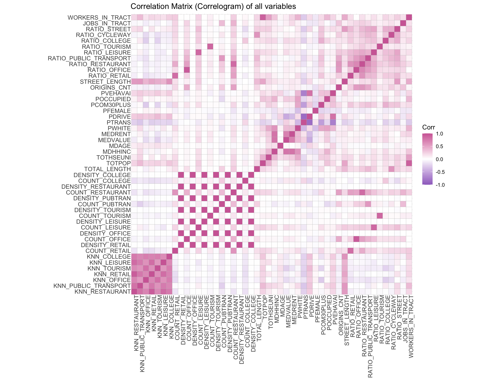
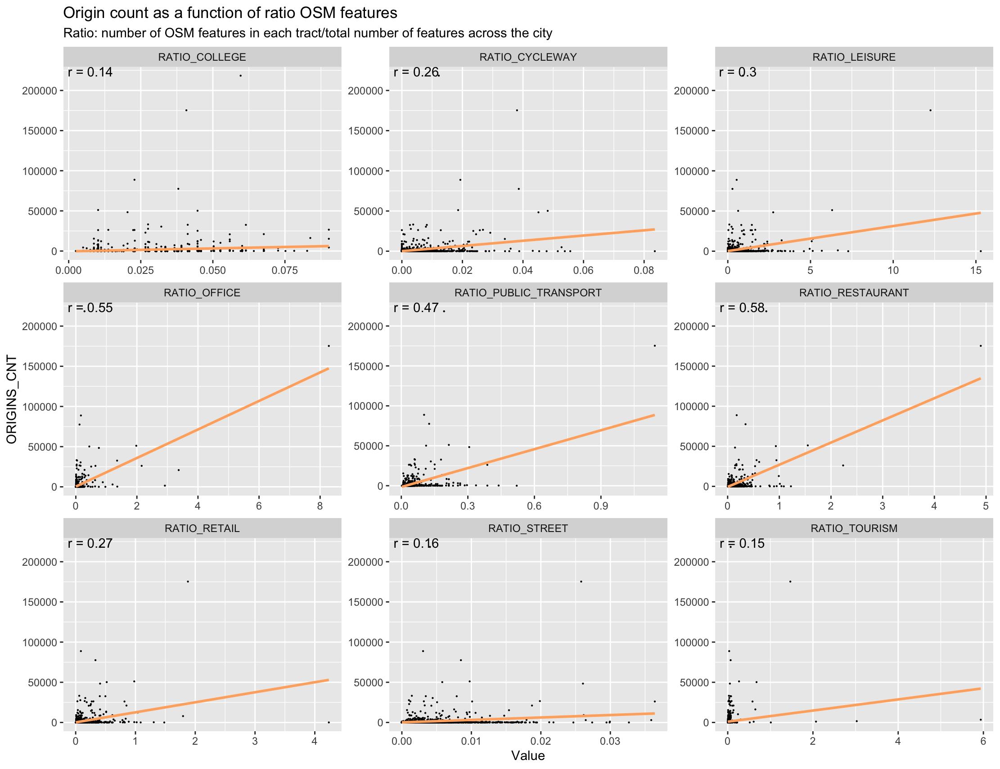
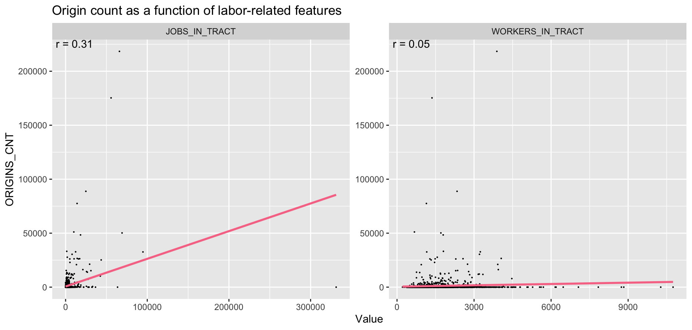
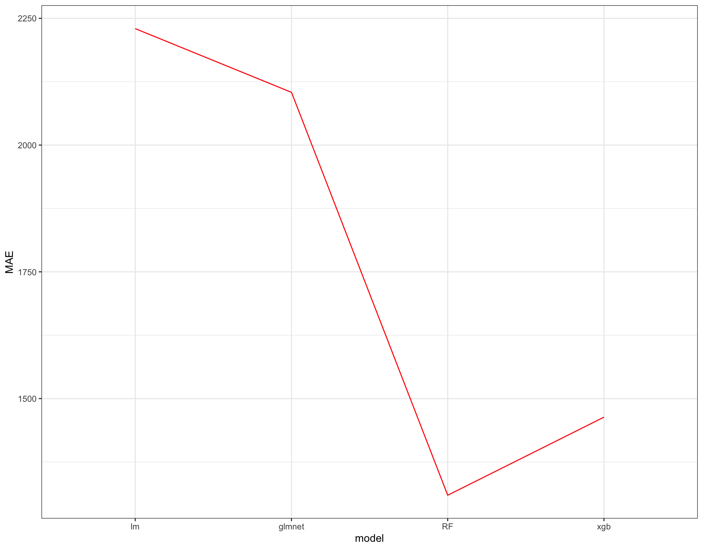
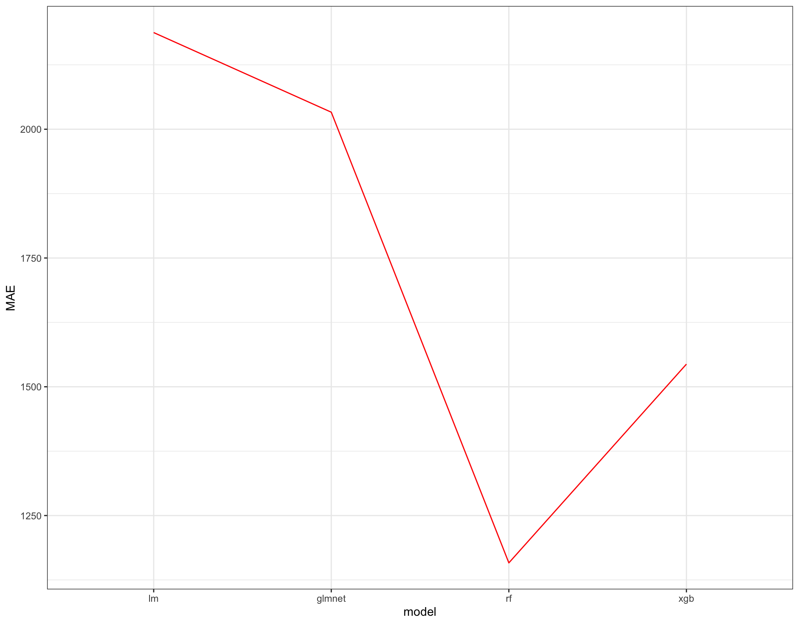
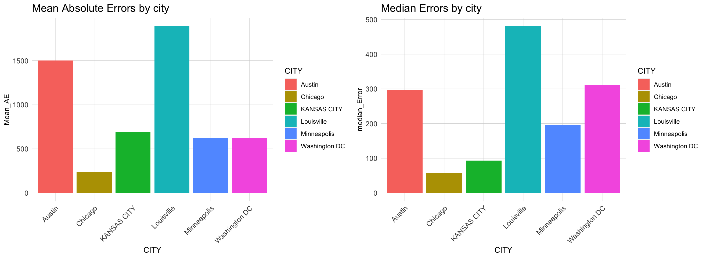
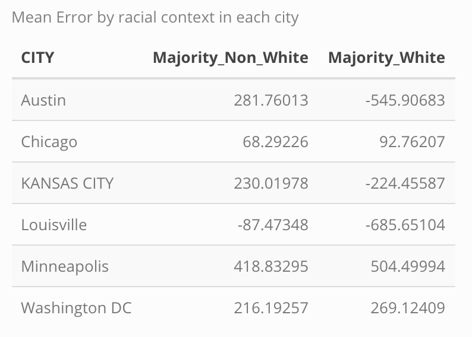

**%% note %% = internal notes**

%% **Question for Michael:** how much code should we be including in this document? Should it just be a report with minimal code and technical information (other than the model evaluation and statistical metrics), with all of our code dumped into an appendix at the end, or should it be a true walkthrough of our process? %%

```{r setup, include=FALSE}
data_directory <- file.path(stringr::str_remove(here::here(), 
                                                "\\/Eugene\\/Eugene - Practicum|\\/Ophelia\\/Ophelia - Practicum|\\/Xinyi\\/Xinyi - Practicum"), 
                        "~data")

knitr::opts_chunk$set(echo = TRUE, message = FALSE, warning = FALSE, cache = TRUE)

census_key_RDS <- file.path(data_directory,
                            "~RData/Census/EC_census_key")
census_key <- readRDS(census_key_RDS)
tidycensus::census_api_key(census_key, install = TRUE, overwrite = TRUE)

setwd(here::here())
options(scipen = 999)

library(knitr)
```

%% Read in all scripts here %%

%% cache all inputs and uncache when scripts are updated %%

```{r load scripts, echo = TRUE, results = "hide"}
# admin
source("~code/01 - Admin (Closed).R")
source("~code/02 - Census Vars and Functions (Closed).R")

# Austin
source("~code/Austin/AU - 02 - Clean Scooter Data (Open).R")
source("~code/Austin/AU - 21 - Collect and Clean Census Data (Open).R")

# Chicago
source("~code/Chicago/CH - 01 - Read Scooter Data (Closed).R")
source("~code/Chicago/CH - 20 - Collect Census Data (Open).R")
source("~code/Chicago/CH - 21 - Clean Census Data (Open).R")

# DC

# Kansas City

# Louisville
source("~code/Louisville/LV - 01 - Read Scooter and Base Map Data (Closed).R")
source("~code/Louisville/LV - 02 - Clean Scooter Data (Closed).R")
source("~code/Louisville/LV - 03 - Prep Rebalance Data - User Events (Closed).R")
source("~code/Louisville/LV - 04 - Prep Rebalance Data - Rebalance Events (Closed).R")
source("~code/Louisville/LV - 20 - Collect Census Data (Closed).R")
source("~code/Louisville/LV - 21 - Clean Census Data (Closed).R")

# Minneapolis

# Model
source("~code/Model/Model - 01 - Setting up (Open).R")
```


# Introduction and Motivation

%% Needs work. Second paragraph doesn't have a motivation and is basically unrelated to first paragraph %%

Since Bird and Lime launched the first shared, dockless electric scooter services in [Santa Monica, California in September 2017](https://www.theverge.com/2018/9/20/17878676/electric-scooter-bird-lime-uber-lyft), scooters have rapidly spread across American cities, becoming a popular form of urban transportation. As of January 2020, there are [340 scooter share programs](https://boxercycles.com/scooter-share-companies/) operating in 242 municipal areas and campuses across 40 different states (plus Washington D.C.). While scooter share providers initially entered new municipalities and markets without local officials' permission or oversight, leading to spikes in scooter-related injuries and complaints of vehicles blocking sidewalks, cities have begun collaborating through coalitions like the [Open Mobility Foundation](https://www.openmobilityfoundation.org/) to institute some oversight over these programs. Municipalities are now working with their scooter providers to ensure that their scooter share programs, among other goals, meet safety standards, distribute vehicles equitably across their cities, keep sidewalks clear, and protect rider privacy. Data standards like the [Mobility Data Specification (MDS)](https://ladot.io/wp-content/uploads/2018/12/What-is-MDS-Cities.pdf), created by the Los Angeles Department of Transportation, help cities share scooter ridership data and make sure that their providers are complying with their policies.

While these data initiatives help address cities manage more mature scooter share programs, there are no widely adopted models in place that help cities without shared scooters introduce the vehicles into their markets. In this project, we use data from 6 different American cities with shared scooters to develop a model that estimates what peak-season demand will be in cities without existing programs. Our goal is to create a municipal scooter planning toolkit that helps cities learn from other municipalities that introduced scooters in the past. We hope that cities like Philadelphia, Pennsylvania and Madison, Wisconsin, which are considering adopting scooter share programs, will find this toolkit helpful as they work with providers to bring the vehicles to their communities.

# Exploratory Analysis

%% What should go here?  Distributions of scooter rides in each city, or distributions of model features? %%

%% Because we have so many features and cities, we need to be selective about what we include. %%

# Case Study: Louisville Rebalancing Compliance

Like many cities with scooter share, the City of Louisville has imposed vehicle caps and distribution requirements on their providers to ensure that scooter companies do not flood high traffic areas of the city with unused vehicles and to promote equitable access to the vehicles across neighborhoods. Louisville's scooter policy is summarized below and can be found in full [here](https://data.louisvilleky.gov/sites/default/files/Dockless_Policy_7_12_2019.pdf "Louisville Dockless Vehicle Policy").

**Policy:**

* Distribution Requirements
  + "To ensure access to shared mobility transportation options throughout the community, Metro has established distribution zones. Distribution zones are intended to ensure that no singular zone is intentionally over-served or under-served. Operators must comply with distributional requirements. Failure to comply with this provision constitutes a breach of the license and may result in the assessment of fleet size reductions, suspension, or even termination of the license. The duration of any suspension shall be at the sole discretion of Metro but will be no less than 6 months. Terminations shall apply for 1 year."

  + For operators with 150 permitted vehicles or fewer, there are no distributional requirements.
  + For operators with permitted fleets ranging in size between 150 and 350 vehicles, 20% of each operator’s vehicles must be located within zones 1 and 9.
  + Distribution plans within Zones 1 and 9 must be submitted to Metro for approval to ensure adequate accessibility for residents of each zone has been achieved.
  + For fleets ranging in size between 350 and 1050 vehicles, 20% of each operator’s vehicles must be located within zones 1 and 9 and 10% must be in zone 8.
  + Distribution plans within Zones 1, 8, and 9 must be submitted to Metro for approval to ensure adequate accessibility for residents of each zone has been achieved.

* Current Vehicle Limits:

  + Bird - 450 max vehicles/day - launched August 2018
  + Lime - 450 max vehicles/day - launched November 2018
  + Bolt - 150 max vehicles/day - launched July 2019
  + Spin - 150 max vehicles/day - launched August 2019

For privacy reasons, most cities (including Louisville) only post geographically aggregated user ride data on their public open data sites. These datasets, while helpful for identifying broad trends in ridership, can lack the geographic resolution to tell us where exactly riders are going. Additionally, the datasets typically do not include any information on vehicle movements other than user rides, meaning we cannot discern where providers are adding or removing vehicles to and from the fleet through maintenance or rebalancing activity.  For our analysis, the City of Louisville shared their providers' _status changes_ dataset (the "**Rebalancing Data**"), a non-public dataset that, in addition to user ride data, includes other vehicle events such as rebalancings and maintenance. These data points are also fully disaggregated. Whereas Louisville's public scooter dataset rounds location coordinates to the third decimal point, the Rebalancing Data includes the raw coordinates.

Using the Rebalancing Data, we investigate whether Louisville's largest two scooter suppliers, Bird and Lime, which are its only suppliers subject to the distribution requirements, have been complying with the city's policy. _At distinct points in time, are Bird and Lime's scooter vehicles distributed across Louisville in compliance with the distribution requirements?_

A map of zones 1, 8, and 9, which must receive a percentage of Bird and Lime's daily fleet as part of the distribution requirements, is shown below.

```{r}
LV_distro_areas <- LV_distro_areas_raw %>% 
  mutate(Dist_Zone = as.character(Dist_Zone),
         # include the requirement for fleets between 350 and 1050. Currently the only requirements that apply
         rebal_req = case_when(Dist_Zone %in% c("1", "9") ~ 0.2,
                                 Dist_Zone == "8" ~ 0.1,
                                 TRUE ~ NA_real_)) %>% 
  st_transform(LV_proj)

LV_distro_areas_map <- LV_distro_areas %>% 
  mutate(Dist_Zone2 = case_when(Dist_Zone %in% c(1, 9) ~ "Zones 1 and 9 (20%)",
                                Dist_Zone == 8 ~ "Zone 8 (10%)",
                                TRUE ~ NA_character_))

ggplot() +
  geom_sf(data = LV_distro_areas_map, aes(fill = Dist_Zone2)) +
  scale_fill_viridis_d(name = "Distribution Zones",
                       limits = c("Zones 1 and 9 (20%)", "Zone 8 (10%)"),
                       direction = -1, 
                       na.value = "lightgray") +
  mapTheme() +
  labs(title = "Scooter Rebalancing Requirements in Louisville")
```

In its raw form, however, the Rebalancing Data is not well-suited for answering this question. The dataset is currently organized around events, where each row is a status change event (the `reason` column) for a particular vehicle (`vehicleId`) that took place at a certain `location` and time (`occurredAt`), making it difficult to develop an aggregate picture for how each operator's vehicles are distributed across the city at any point in time. The dataset tells us about vehicle _flows_, but we need information on the vehicle _fleet_.

```{r}
glimpse(LV_rebal_raw)
```

We solve this problem by selecting the most recent event for each vehicle in the dataset (prior to the selected audit time), finding each vehicle's location, and assessing whether it is available for users. Then, we can aggregate the available scooters by distribution zone to determine whether the scooter providers are in compliance.

The Rebalancing Data contains 11 different status change events. We aggregate these events into three categories: 

* **Active:** Scooters whose most recent event was an Active event are available for users to ride.
* **Reserved:** These scooters are currently being used by a rider.
* **Inactive:** These scooters are not available to users. We consider them removed from the vehicle fleet.

```{r}
LV_active_status <- c("user drop off",
                      "rebalance drop off",
                      "maintenance drop off",
                      "service start",
                      "user pick up")

LV_reserved_status <- c("user pick up")

LV_inactive_status <- c("rebalance pick up",
                        "maintenance pick up",
                        "service end",
                        "low battery",
                        "maintenance")
```

We next set time periods for our rebalancing audits. We decided to audit the vehicle fleet at 7AM every Friday for 13 months, from November 15th, 2018 to December 15th, 2019. We chose 7AM because our exploratory analysis revealed to us that most rebalancing activity occurs in the nighttime and early morning hours.

```{r}
LV_rebal_DOW_data <- LV_rebal_rebalance_only %>% 
  mutate(hour = hour(occurredAt),
         weekday = lubridate::wday(occurredAt, label = TRUE))

LV_rebal_DOW_data %>% 
  ggplot() +
  geom_freqpoly(aes(hour, color = weekday), binwidth = 1) +
  labs(title = "Scooter Rebalancing in Louisville by day of week and hour",
       x="Hour", 
       y="Trip Counts")+
  xlim(0, 23)+
  theme_minimal()

time_intervals <- seq(from = as.POSIXct("2018-11-15 07:00:00 EDT"), 
                      to = as.POSIXct("2019-12-15 07:00:00 EDT"),
                      by = "1 week")
```

We then define a function to extract the most recent Active status in the dataset for each vehicle before our 57 selected audit times. We also remove any scooter whose most recent Active status occurred over 10 days prior to the audit time from the dataset. We assume that these scooters have been removed from the active vehicle fleet without a corresponding status change record.

```{r, eval = FALSE}
plan(multiprocess) ## FOR PARALLEL PROCESSING

LV_extract_latest_status2 <- function(trip_dat, datetime, buffer, 
                                      Astatus = LV_active_status){
  time <- as.POSIXct(datetime)
  tmp <- trip_dat[which(trip_dat$occurredAt <= time),]
  # first pass to modify is data remains
  if(nrow(tmp) > 0) {
    tmp <- tmp[order(tmp$occurredAt),]
    tmp <- tmp[nrow(tmp),]
    tmp <- tmp[as.numeric(time - tmp$occurredAt) <= buffer,]
    tmp <- tmp[tmp$reason %in% Astatus,] 
  }
  # 2nd pass if the above still had rows (e.g. stilla active)
  if(nrow(tmp) > 0) {
    output <- tmp
    output$Date <- as.Date(output$occurredAt)
    output$Hour <- lubridate::hour(output$occurredAt)
    output$active <- 1
    output <- output[,c("vehicleId", "Date", "Hour", 
                        "operators", "active", "long", "lat")]
  } else { # if the scooter is "unavailable"
    output <- data.frame(vehicleId = trip_dat$vehicleId[1],
                         Date = as.Date(time),
                         Hour = hour(time),
                         operators = trip_dat$operators[1],
                         active = 0,
                         long = NA_real_,
                         lat = NA_real_,
                         stringsAsFactors = FALSE)
  }
  return(output)
}

new_func_parallel <- function(...){
  rebal_lst <- LV_rebal_sf %>% 
    mutate(long = st_coordinates(.)[,1], 
           lat = st_coordinates(.)[,2]) %>%
    st_drop_geometry() %>%
    split(.$vehicleId)
  
  LV_rebal_sf_list_i <- future_map(time_intervals,
                                   function(x) map(rebal_lst, function(y){LV_extract_latest_status2(y, x, 10)}) %>%
                                     bind_rows() %>% 
                                     mutate(audit_date = x), .progress = TRUE) %>% 
    bind_rows()
}

new_results_parallel <- new_func_parallel() # same as LV_rebal_sf_list

glimpse(new_results_parallel)
```

```{r, echo = FALSE}
LV_new_results_parallel_RDS <- file.path(data_directory, 
                                         "~RData/Louisville/LV_new_results_parallel")

new_results_parallel <- readRDS(LV_new_results_parallel_RDS)
glimpse(new_results_parallel)
```

Next, we aggregate the available scooters across the distribution zones. We determine whether an operator is in compliance with the distribution requirements based on the percentage of the vehicle fleet in zones 1, 8, and 9 and the total size of that vehicle fleet at that time. The two sets of distribution requirements only apply to operators permitted to operate over 150 and over 350 scooters in the city, respectively. While Bird and Lime are each permitted to deploy 450 vehicles now, we were unable to determine when their vehicle limits were raised to 150 and 350. As a proxy for vehicle limit, we instead use the total size of their fleets as reflected in the dataset (`scooter_total`). We acknowledge, however, that this may underestimate the two companies' permitted fleet size at the time, as the maximum active fleet size we calculated during our 57 audits was 339, far short of their 450-vehicle maxes.

```{r, eval = FALSE}
LV_rebal_sf_list_2 <- new_results_parallel %>% 
  filter(!is.na(long),
         !is.na(lat)) %>% 
  st_as_sf(coords = c("long", "lat"), crs = LV_proj, remove = FALSE) %>% 
  st_join(., LV_distro_areas %>% dplyr::select(Dist_Zone)) %>% 
  st_drop_geometry() %>% 
  mutate(Dist_Zone = factor(Dist_Zone,
                            levels = paste(1:9)))

LV_rebal_sf_list_summary <- new_results_parallel %>% 
  left_join(LV_rebal_sf_list_2 %>% dplyr::select(vehicleId, Dist_Zone, audit_date), by = c("vehicleId", "audit_date")) %>% 
  group_by(audit_date, Dist_Zone, operators, .drop = FALSE) %>% 
  summarize(scooters = n()) %>% 
  filter(str_detect(operators, "Bird|Lime"),
         !is.na(Dist_Zone)) %>%
  ungroup() %>%
  group_by(audit_date, operators) %>%
  mutate(scooter_total = sum(scooters),
         scooter_pct = scooters / scooter_total)

LV_rebal_sf_list_summary_2 <- LV_rebal_sf_list_summary %>% 
  dplyr::select(-scooter_pct) %>% 
  spread(Dist_Zone, scooters, sep = "_") %>% 
  mutate(Dist_8_pct = ifelse(is.na(Dist_Zone_8 / scooter_total), 0, Dist_Zone_8 / scooter_total), 
         Dist_1_9_pct = ifelse(is.na((Dist_Zone_1 + Dist_Zone_9) / scooter_total), 0, (Dist_Zone_1 + Dist_Zone_9) / scooter_total),
         compliance = case_when(scooter_total > 150 & Dist_1_9_pct < 0.2 ~ "No",
                                scooter_total > 350 & (Dist_1_9_pct < 0.2 | Dist_8_pct < 0.1) ~ "No",
                                TRUE ~ "Yes"))

LV_rebal_sf_list_summary_map <- LV_rebal_sf_list_summary %>% 
  ungroup() %>% 
  group_by(Dist_Zone, operators) %>% 
  summarize(scooter_pct = mean(scooter_pct, na.rm = TRUE)) %>% 
  left_join(LV_distro_areas, by = "Dist_Zone") %>% 
  st_as_sf() %>% 
  arrange(operators)

LV_rebal_sf_list_summary_2_map <- LV_rebal_sf_list_summary_2 %>% 
  gather(dist_zone, dist_pct, Dist_8_pct:Dist_1_9_pct) %>% 
  mutate(requirement = case_when(dist_zone == "Dist_8_pct" ~ 0.1,
                                 dist_zone == "Dist_1_9_pct" ~ 0.2,
                                 TRUE ~ NA_real_),
         dist_zone = factor(case_when(dist_zone == "Dist_8_pct" ~ "Dist_8_pct",
                                      dist_zone == "Dist_1_9_pct" ~ "Dist_1_9_pct",
                                      TRUE ~ NA_character_),
                            levels = c("Dist_8_pct", "Dist_1_9_pct"),
                            labels = c("Zone 8", "Zone 1 & 9")))

LV_rebal_sf_list_summary_2_map
```

```{r, echo = FALSE}
LV_rebal_sf_list_2 <- new_results_parallel %>% 
  filter(!is.na(long),
         !is.na(lat)) %>% 
  st_as_sf(coords = c("long", "lat"), crs = LV_proj, remove = FALSE) %>% 
  st_join(., LV_distro_areas %>% dplyr::select(Dist_Zone)) %>% 
  st_drop_geometry() %>% 
  mutate(Dist_Zone = factor(Dist_Zone,
                            levels = paste(1:9)))

LV_rebal_sf_list_summary <- new_results_parallel %>% 
  left_join(LV_rebal_sf_list_2 %>% dplyr::select(vehicleId, Dist_Zone, audit_date), by = c("vehicleId", "audit_date")) %>% 
  group_by(audit_date, Dist_Zone, operators, .drop = FALSE) %>% 
  summarize(scooters = n()) %>% 
  filter(str_detect(operators, "Bird|Lime"),
         !is.na(Dist_Zone)) %>%
  ungroup() %>%
  group_by(audit_date, operators) %>%
  mutate(scooter_total = sum(scooters),
         scooter_pct = scooters / scooter_total)

LV_rebal_sf_list_summary_2 <- LV_rebal_sf_list_summary %>% 
  dplyr::select(-scooter_pct) %>% 
  spread(Dist_Zone, scooters, sep = "_") %>% 
  mutate(Dist_8_pct = ifelse(is.na(Dist_Zone_8 / scooter_total), 0, Dist_Zone_8 / scooter_total), 
         Dist_1_9_pct = ifelse(is.na((Dist_Zone_1 + Dist_Zone_9) / scooter_total), 0, (Dist_Zone_1 + Dist_Zone_9) / scooter_total),
         compliance = case_when(scooter_total > 150 & Dist_1_9_pct < 0.2 ~ "No",
                                scooter_total > 350 & (Dist_1_9_pct < 0.2 | Dist_8_pct < 0.1) ~ "No",
                                TRUE ~ "Yes"))

LV_rebal_sf_list_summary_map <- LV_rebal_sf_list_summary %>% 
  ungroup() %>% 
  group_by(Dist_Zone, operators) %>% 
  summarize(scooter_pct = mean(scooter_pct, na.rm = TRUE)) %>% 
  left_join(LV_distro_areas, by = "Dist_Zone") %>% 
  st_as_sf() %>% 
  arrange(operators)

LV_rebal_sf_list_summary_2_map <- LV_rebal_sf_list_summary_2 %>% 
  gather(dist_zone, dist_pct, Dist_8_pct:Dist_1_9_pct) %>% 
  mutate(requirement = case_when(dist_zone == "Dist_8_pct" ~ 0.1,
                                 dist_zone == "Dist_1_9_pct" ~ 0.2,
                                 TRUE ~ NA_real_),
         dist_zone = factor(case_when(dist_zone == "Dist_8_pct" ~ "Dist_8_pct",
                                      dist_zone == "Dist_1_9_pct" ~ "Dist_1_9_pct",
                                      TRUE ~ NA_character_),
                            levels = c("Dist_8_pct", "Dist_1_9_pct"),
                            labels = c("Zone 8", "Zone 1 & 9")))

LV_rebal_sf_list_summary_2_map
```

Below, we chart the percentage of each operator's vehicle fleet that could be found in the three distribution zones at the time of each audit. The red line on each chart indicates the minimum percentage of the vehicle fleet that must be located in each zone to comply with the distribution requirements.

While we emphasize again that we are not sure when the distribution requirements took effect for Bird and Lime, we can see that even in the later months of 2019, when we can assume their vehicle fleet limits were near their current 450, there are only two instances where either company was in compliance with at least one of the requirements.

```{r, fig.width=12, fig.height = 10}
ggplot(LV_rebal_sf_list_summary_2_map,
       aes(x = audit_date,
           y = dist_pct, 
           fill = operators)) +
  geom_bar(stat = "identity",
           position = "dodge") +
  geom_hline(data = LV_rebal_sf_list_summary_2_map, 
             aes(yintercept = requirement),
             color = "red",
             size = 1) +
  facet_wrap(operators~dist_zone, ncol = 1) +
  plotTheme +
  labs(title = "Percentage of Scooters in Distribution Zones",
       subtitle = "Each audit conducted at 7AM",
       y = "Percentage of all Scooters",
       x = "Audit Date")  +
  scale_x_datetime(date_labels = "%Y-%m-%d",
                   breaks = LV_rebal_sf_list_summary_2_map$audit_date) + 
  scale_fill_discrete(name = "Distribution Zone") +
  theme(axis.text.x = element_text(angle = 45, hjust = 1))
```

# Feature Engineering

For the model, we'll be predicting the total number of scooter trips taken from July to September in every census tract in the six target cities. We chose this time period partially due to data limitations - Chicago only recently instituted scooter share and does not have a full year of data available - and because the late summer and early fall represent peak ridership. We chose census tracts as our geographical unit of analysis because they represent the largest level of geographic aggregation in the scooter datasets (Austin). 

%% Here we should insert line graphs showing annual ridership by month for every scooter system for which we have a full year of data. %%

Using the Census and OpenStreetMap, we collect numerous socioeconomic, demographic, and built environment variables for the six cities in our study and construct 24 features that we believe may be useful predictors for scooter demand in a census tract:

* Socio-economic and demographic:

    + **TOTPOP:** Total population
    + **TOTHSEUNI:** Total housing units
    + **MDHHINC:** Median household income (2018 dollars)
    + **MDAGE:** Median age
    + **MEDVALUE:** Median home value
    + **MEDRENT:** Median rent
    + **PWHITE:** % of the population that is white
    + **PTRANS:** % of the population that takes transit to work
    + **PDRIVE:** % of the population that drives to work
    + **PFEMALE:** % of the population that is female
    + **PCOM30PLUS:** % of the population with a commute >30 minutes
    + **POCCUPIED:** Housing occupancy rate
    + **PVEHAVAI:** % of the population that owns a vehicle
    + **JOBS_IN_TRACT:** The number of jobs located in this tract
    + **WORKERS_IN_TRACT:** The number of workers who live in this tract

* Built environment: 

    + **RATIO_RETAIL:** % of the city's retail found in this tract
    + **RATIO_OFFICE:** % of the city's offices found in this tract
    + **RATIO_RESTAURANT:** % of the city's restaurants found in this tract
    + **RATIO_PUBLIC_TRANSPORT:** % of the city's public transportation found in this tract
    + **RATIO_LEISURE:** % of the city's places for leisure activity found in this tract
    + **RATIO_TOURISM:** % of the city's tourist attractions found in this tract
    + **RATIO_COLLEGE:** % of the city's university buildings found in this tract
    + **RATIO_CYCLEWAY:** % of the city's cycle infrastructure found in this tract
    + **RATIO_STREET:** % of the city's streets found in this tract

```{r}
glimpse(Model_clean)
```

%% Need to include some exploration of the OSM variables here. Need to address: is the distribution of ratio the same across cities despite having different numbers of census tracts, or do they need to be standardized in some way? %%

Below, we display a correlation matrix of our model features. Note that we also include count, nearest-neighbor, and density versions of the OSM features listed above.

%% Update this whenever we have a final list of model variables. We should also have one or two takeaways from this. It's too much for a reader to make sense of. %%

```{r}

```

Next, we explore the ability for each of these features to explain the variation in raw trip counts in each tract. With a few exceptions, most of the variables on their own have weak explanatory power. The largested R^2^ value we observe of 0.58 for `RATIO_RESTAURANT`.

**Socio-economic and demographic variables**

```{r}
include_graphics("Plots_model/Correlation_scatter_census.png")
```

**Built environment variables**

```{r}

```

**Labor variables**

```{r}

```

# Model Building

%% For now we just show modeling results. When we're approaching a final model, we should include more of the steps we took. %%

We used these features to construct several models that would predict raw trip counts in each census tract for the cities in our study. As shown by the error rates below, the random forest model had the best performance, but errors were extremely high.

**Out-of-fold predictions**

```{r}

```

**Validation set**

```{r}

```

We cross-validated the model using 20 random folds as well as by leaving one city out of the training data. As shown below, the model currently generalizes poorly to data from out-of-sample cities.

```{r}
include_graphics(c("Plots_model/PredVSreal_bymodel(OOF).png",
                   "Plots_model/Bycity_PredVSreal_OOF.png"))
```

Looking at our best performing model, the model trained using random forest, we see that errors are quite high across the cities. The mean absolute percent errors range from a low of about 50% in Chicago to a high of nearly 500% in Louisville.

```{r}

```

The model also varies greatly in performance across racial contexts. Below, we see variations in error between majority white and majority non-white census tracts in the cities in our study.

```{r}

```


